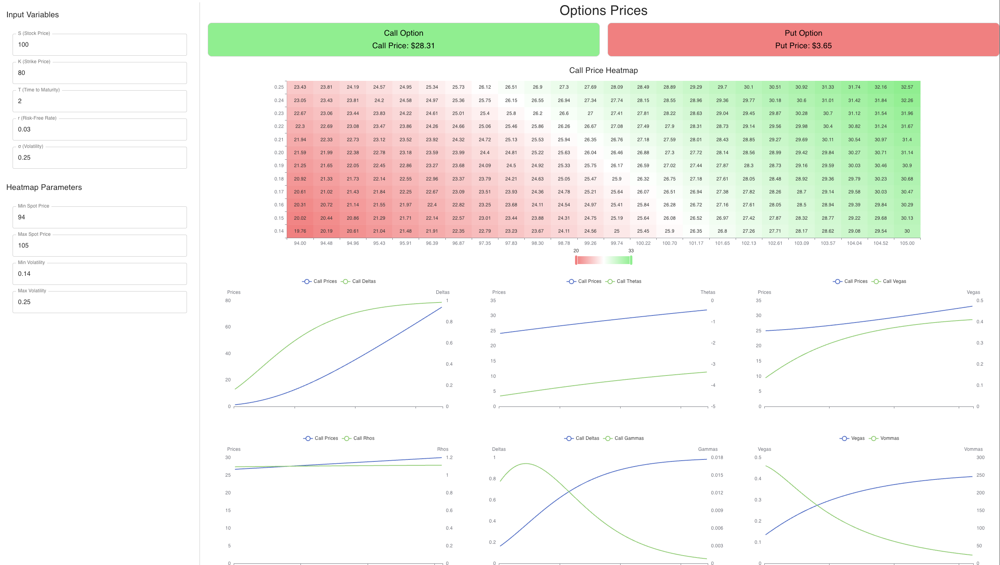

# Options Pricing Tool
This project is an **Options Pricing Tool** designed to price, compare and visualise options with different models and methods 

## Features
- **Options Pricing**: Calculates and displays call and put option prices based on user inputs
- **Heatmap Visualisation**: Provides heatmaps to visualise option prices for real-time sensitivity analysis
- **User Input Management**: Allows users to input and adjust variables such as spot price, strike price, volatility and more

## Planned Features
- **Support for Various Pricing Models**: Integrate multiple option pricing models such as Black-Scholes, Binomial and Monte Carlo simulations
- **Advanced Visualisations**:Include additional charts and graphs for deeper analysis of option pricing trends

## Technology Stack

